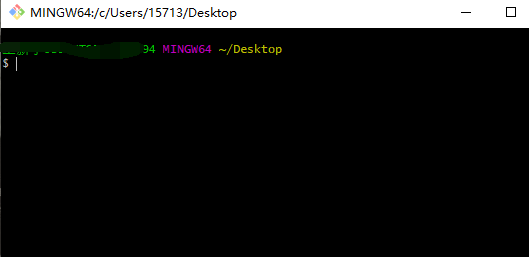

# 第六章：Node.js

> 在浏览器中，javascript 代码通过 Js 解析引擎，呈现最终效果


基于 Express/Koa 框架 [http://www.expressjs.com.cn/](http://www.expressjs.com.cn/) ，可以快速构建 Web 应用

基于 Electron 框架 [https://electronjs.org/](https://electronjs.org/) ， 可以构建跨平台的桌面应用，比如 vscode

基于 restify 框架 [http://restify.com/](http://restify.com/) ，可以快速构建 API 接口项目

读写和操作数据库、创建实用的命令行工具辅助前端开发


## Node.Js 环境

> Node.js 是一个基于 Chrome V8 引擎的 JavaScript 运行环境。 
>
> 通俗的理解：Node.js 为 JavaScript 代码的正常运行，提供的必要的环境。

WebAPI是浏览器特有的，只能在浏览器环境下使用；

Node内置API（内置模块）是Node环境特有的，只能在Node环境中使用


## NodeJS安装

> 1. 前往 **[Node.js 的官网](https://nodejs.org/zh-cn/)** 下载安装包
> 2. 安装后，打开终端窗口，执行 node -v 命令，如果看到版本号，说明安装成功。
> 3. **在Node环境中运行JS代码或JS文件，需要在终端窗口中运行**


## 交互模式（了解）

打开任意终端，直接输入 node 命令并回车

执行你的JS代码，按回车表示执行

按两次 “Ctrl+C” 退出

```cmd
C:\Users\15713> node
Welcome to Node.js v14.16.0.
Type ".help" for more information.
> 

退出 按两次 ctrl + C
(To exit, press Ctrl+C again or Ctrl+D or type .exit)
>
```


## 脚本模式（重要）

> 如果有大段的JS代码需要在Node环境中运行，可以把JS代码写到 JS 文件中
> 
> 
> 
> 终端中，使用 node xxx.js 命令即可运行文件中的代码
> 
> ```cmd
> C:\Users\15713>cd Desktop
> 
> C:\Users\15713\Desktop>node 1.js
> 1
> 
> C:\Users\15713\Desktop>
> ```


## DOS 常用命令

```cmd
创建文件夹
mkdir 文件夹名

删除文件夹
rmdir 文件夹名

创建文件
echo > 文件名

删除文件
del 文件名
```


## 模块化设计

> **Node中的模块化，就是把一个大的 JS 文件拆分成若干个小文件**，我们可以按照一定的语法将这些小模块组合到一起，形成一个完整的项目。
>
> **用户创建的每个JS文件，**就是一个小模块，**叫做自定义模块** 
>
> 模块化的**优点**：
>
> - **更利于维护** 
> - **更好的复用性 ** 
> - 解决了在一个 JS 文件中引入 另一个 JS 文件的变量 的问题
> - 实现了按需加载文件，减少了不必要的开销
> - 可以让项目变得更加简单（一个项目就是由许许多多的模块组成的）


### Node中模块化的实现

> module.exports：共享当前作用域变量
> 
> require() 方法：加载共享的变量


```javascript
// hello.js

let a = 123;
let fn = x => x * x;

// 共享变量
module.exports = {		// 对外暴露的数据
    a: a,
    fn: fn,
};
```

```javascript
// test.js

let obj = require('./test.js');	// 需要文件的路径
console.log(obj);
console.log(obj.a);

let {a,fn} = require('./hello.js');
console.log(a);
console.log(fn);
```


==VS Code 打开终端 快捷方式==

- 打开调试控制台：Ctrl + Shift + Y
- Code Runner 插件：Ctrl + Alt + N


### Node中的模块分类

- **内置模块（核心模块）**：Node安装后，即可使用的模块，Node环境自带。
- **自定义模块**：用户自己创建的每个JS文件，都是自定义模块
- **第三方模块**：其他人或公司、组织开发的模块，发布到 npm 网站，我们需要下载使用的模块


### 加载模块的语法

#### 加载自定义模块

- a 文件，必须**通过 module.exports 共享**（导出、暴露）当前模块中的变量

- b 文件，需要**通过 require() 加载**（导入）。（a 文件导出什么，b 文件就得到什么）

- 加载自定义模块时，**必须要带路径** （相对路径、绝对路径都可以；但必须带路径，哪怕是 ./ 也不能省略）

- 加载自定义模块时，可以省略后缀

#### 加载内置模块

- 直接使用 require() 加载即可。

- 加载模块时，**无需带路径**，比如 require('fs')

- 加载内置模块，得到对象类型，对象中内置了很多API方法

#### 加载第三方模块

- 必须先下载（后续讲解）


### 通过模块化，调用封装的函数

#### 案例：首字母大写

>模块化：字符串首字母变大写、其他字母转小写的函数

lib.js   封装文件

```javascript
function letterChange (str) {
    return str[0].toUpperCase() + str.slice(1).toLowerCase();
}

// 对外暴露函数
module.exports = {
    letterChange: letterChange,
}
```

home.js   调用文件

```javascript
// 加载共享
let { letterChange } = require('./lib.js');

var r = letterChange('heLLOWoRd');

console.log(r);		// Helleword
```


#### 案例：数组排序 sort

>输入哪个属性，就对哪个属性进行排序

lib.js   封装文件

```javascript
// arr: 需要排序的数组    type: 需要排序的类型	flag: true 升序 / false 降序
function Sort (arr, type, flag) {
    return arr.sort( (item1, item2) => {
        return flag ? item1[type] - item2[type] : item2[type] - item1[type];
    });
}

// 对外暴露函数
module.exports = {
    Sort,
}
```

home.js   调用文件

```javascript
// 加载共享
let { Sort } = require('./hello.js');

var arr = [
    {
        uname: '张三',
        age: 17,
        score: 90,
    },
    {
        uname: '李四',
        age: 20,
        score: 80,
    },
    {
        uname: '王五',
        age: 10,
        score: 70,
    },
];

// 输入哪个属性，就对哪个属性进行排序
console.log(Sort(arr, 'score', false));
```


## 内置模块

> Node内置模块有很多，具体参见 [http://nodejs.cn/api/](http://nodejs.cn/api/)
>
> **加载内置模块：let 变量 = require('模块名');** 
>
> **模块和模块之间很好区分，看模块名即可确定他们的作用** 

### path 模块 (路径)

> 路径模块，所有路径相关的操作都通过 path 模块。

```javascript
// 创建 path 模块
const path = require('path');
```


#### path.extname()

> **获取路径中的后缀**，参数：一个路径。

```javascript
const path = require('path');
var url = 'a/b/c/index.js';

console.log( path.extname(url) );	// .js
```


#### path.join()

> **拼接给出的路径**，参数：两个或更多路径。

```javascript
const path = require('path');
var star = 'a/b/c';
var end = 'd/e/index.html';

console.log( path.join(star, end) );	// a/b/c/d/e/index.html
```

**==Node 中，有一个全局变量` __dirname`，表示 当前 JS 文件所在的绝对路径。==** 

```javascript
console.log( __dirname );	// C:\Users\Admin\Desktop
```


#### querystring

> 查询字符串，所有查询字符串相关的操作，都可以使用 querystring。

什么格式的字符串是查询字符串：id=1 & name=zs & age=20

将查询字符串，转成对象

将对象转成查询字符串

```javascript
待补充
```


#### querystring.parse()

> 将查询字符串转换成 Js 对象，参数：一个查询字符串。

```javascript
待补充
```


#### querystring.stringify()

> 将 Js 对象转成 查询字符串，参数：一个字面量 Js 对象。

待补充


### HTTP 模块

> request：请求信息对象
> 
> response：响应对象信息

```javascript
// 加载 http 模块
const http = require('http');

// 使用 http 模块创建 web 服务器
let server = http.createServer();

// 监听请求 request 事件
server.on('requset', function (req, res) {
    // 设置响应头信息
    res.setHeader('Content-type', 'text/pain;charset=utf-8;');
    // 向客户端相应数据
    res.end('这是一串文本');
});

// 监听端口号
server.listen(5555, function () {
    console.log('端口5555已经启动成功');
})
```


#### nodemon 插件

```nmp
nmp install -g nodemon
```


#### request 对象

待补充

#### response 对象

待补充


### npm 模块

> 第三方模块，Node 包(模块) 管理器

下载第三方模块：发布在 npm 网站上 [https://www.npmjs.com](https://www.npmjs.com) 

> 下载这些模块，需要用到 npm 工具

#### npm初始化

- 下载第三方模块之前，必须先初始化

```node
npm init -y
```

#### 下载第三方模块

```node
npm install 模块名 模块名 模块名 ……

npm install jquery
```

```javascript
// 简写：
npm i 模块名 模块名 模块名 ……

npm i jquery
```

#### 卸载第三方模块

```node
npm uninstall 模块名 模块名 模块名 ……

npm uninstall jquery
```

```javascript
// 简写：
npm un 模块名 模块名 模块名 ……

npm un jquery
```


#### 安装 dependencies 下所有的包

> 传项目文件时，只需要传代码和 package.json 文件，不需要传 node_modules 包

```javascript
npm i
```


#### 下载第三方模块注意事项

- 文件夹 **不能有中文和特殊符号**，比如 “练习”、“ajax&node” 都不可以。

- 文件夹 **不能 和 第三方模块同名** 

- 下载的第三方模块在当前文件夹中的 **node_modules** 目录中

- 下载的第三模块，只能在当前文件夹及其后代文件夹中使用

- 可以通过 **package.json** 文件，查看到我们下载了哪些模块

  > dependencies 下显示的是所有下载的模块


#### 使用第三方模块

> 第三方模块基本都有 API 文档。

```javascript
// 加载第三方模块 格式
const xxx= require('xxx');
```

实例：处理时间模块 moment

```javascript
// 初始化
npm init -y
// 下载
npm install moment
// 加载
const moment = require('moment');
// 简单使用
moment().format('YYYY-MM-DD-HH:mm:ss');
```

